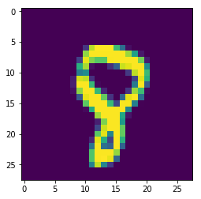
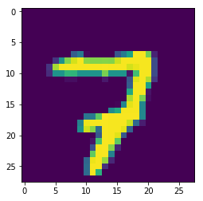
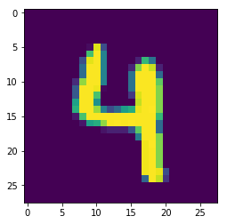
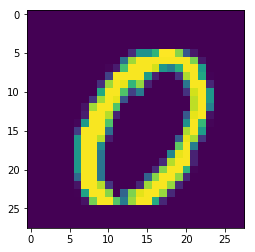

# Deep Convolutional MNIST Classifier using Tensorflow

This is a convolutional nerual network with 11 conv-layer and 3 fc-layer base on VGG19, I removed 8 conv-layer and 3 pooling layer to make sure all datas fits in my GPU memory. The project is based on github project tensorflow-vgg19 [https://github.com/machrisaa/tensorflow-vgg]

### Initialization
MNIST dataset is included in Tensorflow as an example dataset. I choise MNIST because it's relatively smaller and spending less time to train. It's good for practicing CNN and Tensorflow


```python
%load_ext autoreload
%autoreload 2
%matplotlib inline

import matplotlib.pyplot as plt
import matplotlib.image as mpimg
import tensorflow as tf
import numpy as np
import utils
import vgg19_trainable as vgg19
from tensorflow.examples.tutorials.mnist import input_data

mnist = input_data.read_data_sets('MNIST_data', one_hot=True)
```

    Extracting MNIST_data\train-images-idx3-ubyte.gz
    Extracting MNIST_data\train-labels-idx1-ubyte.gz
    Extracting MNIST_data\t10k-images-idx3-ubyte.gz
    Extracting MNIST_data\t10k-labels-idx1-ubyte.gz
    


```python
sess = tf.Session()
batch_size = 300

images = tf.placeholder(tf.float32, [None, 28, 28, 1])
true_out = tf.placeholder(tf.float32, [None, 10])
train_mode = tf.placeholder(tf.bool)

vgg = vgg19.Vgg19()
vgg.build(images, train_mode)

print(vgg.get_var_count())
```

    4417786
    

### MNIST dataset
The MNIST dataset is a hand writen digit classification dataset.


```python
# test classification
sess.run(tf.global_variables_initializer())

batch = mnist.train.next_batch(batch_size)
batch_img = batch[0].reshape((-1,28,28,1))
batch_lbl = batch[1]

print(batch_img.shape, batch_lbl.shape)

print (np.argmax(batch_lbl[0]))
print (np.argmax(batch_lbl[1]))
print (np.argmax(batch_lbl[2]))
print (np.argmax(batch_lbl[3]))


plt.figure()
plt.imshow(batch_img[0,:,:,0])
plt.figure()
plt.imshow(batch_img[1,:,:,0])
plt.figure()
plt.imshow(batch_img[2,:,:,0])
plt.figure()
plt.imshow(batch_img[3,:,:,0])
```

    (300, 28, 28, 1) (300, 10)
    8
    7
    4
    0
    


    <matplotlib.image.AxesImage at 0x1ff2c33b2b0>














### Define loss function and training process


```python
cost = tf.reduce_sum((vgg.prob - true_out) ** 2)
train = tf.train.AdamOptimizer(0.001).minimize(cost)

correct_prediction = tf.equal(tf.argmax(vgg.prob, 1), tf.argmax(true_out, 1))
accuracy = tf.reduce_mean(tf.cast(correct_prediction, tf.float32))
```

### Accuracy Before Training
After randomization, all weights of the network is set to random value, so the prediction should be totally random. Because we have 10 digits in this dataset, the accuracy of prediction of random guess should be around 10%. In this case, the initialization has 14.4% of accuracy.


```python
sess.run(tf.global_variables_initializer())

vbatch = mnist.validation.next_batch(500)
vbatch_img = vbatch[0].reshape((-1,28,28,1))
vbatch_lbl = vbatch[1]

print ('accuracy: ', sess.run(accuracy, feed_dict={images: vbatch_img, true_out: vbatch_lbl, train_mode: False}))
```

    accuracy:  0.144
    

### Training
Within 100 iteration, the accuracy increase to 94.4% on validation data set.


```python
for i in range(1000):
    batch = mnist.train.next_batch(batch_size)
    batch_img = batch[0].reshape((-1,28,28,1))
    batch_lbl = batch[1]
    sess.run(train, feed_dict={images: batch_img, true_out: batch_lbl, train_mode: True})
    if i % 50 == 0:
        print( 'iteration: ', i)
        vbatch = mnist.validation.next_batch(500)
        vbatch_img = vbatch[0].reshape((-1,28,28,1))
        vbatch_lbl = vbatch[1]
        print ('accuracy: ', sess.run(accuracy, feed_dict={images: vbatch_img, true_out: vbatch_lbl, train_mode: False}))
```

    iteration:  0
    accuracy:  0.09
    iteration:  50
    accuracy:  0.884
    iteration:  100
    accuracy:  0.944
    iteration:  150
    accuracy:  0.982
    iteration:  200
    accuracy:  0.974
    iteration:  250
    accuracy:  0.96
    iteration:  300
    accuracy:  0.978
    iteration:  350
    accuracy:  0.98
    iteration:  400
    accuracy:  0.984
    iteration:  450
    accuracy:  0.972
    iteration:  500
    accuracy:  0.988
    iteration:  550
    accuracy:  0.986
    iteration:  600
    accuracy:  0.99
    iteration:  650
    accuracy:  0.988
    iteration:  700
    accuracy:  0.978
    iteration:  750
    accuracy:  0.974
    iteration:  800
    accuracy:  0.98
    iteration:  850
    accuracy:  0.976
    iteration:  900
    accuracy:  0.994
    iteration:  950
    accuracy:  0.978
    

### Validation
After 1000 iterations, the accuracy on validation dataset increase to 98.75%. 


```python
vbatch = mnist.validation.next_batch(2000)
vbatch_img = vbatch[0].reshape((-1,28,28,1))
vbatch_lbl = vbatch[1]
print(sess.run(accuracy, feed_dict={images: vbatch_img, true_out: vbatch_lbl, train_mode: False}))
```

    0.9875
    
